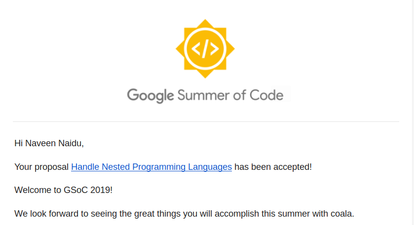
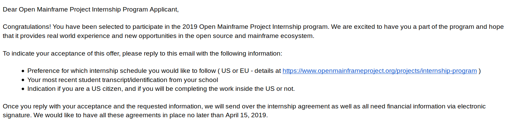

Hola People!

It's been raining since evening here. Though I'm not much of a rainy person, I 
like the cold breeze that the rain bring with it. The feeling of the
cold breeze rustling through my hair and my face rejuvenates me. In one word, it's
orgasmic. I do not have any pictures of today, But I'll make sure to capture
a few when the weather turns sexy again.


Anyway this post is about the `New Adventure` that I have embarked upon. This post is
kinda late. I'm glad to inform you that I have been selected as:
#### **Google Summer of Code Student 2019 for *coala***


-------------------------------------------------------------------------------

#### **Open Mainframe Project(Linux Foundation) Internship**



-------------------------------------------------------------------------------

Both of these are Open Source Projects and I get to work remotely from the 
comforts of my small lovely *hostel* room. *Lovely? Really? Umm! Yeah it's lovely
if you ignore the mess that my Cough! roomates Cough! make in the room xD*.
I think I forgot to mention that I am a big Open Source afficianado. I love it.
It's been the only platform that helped me grow. If I go on about why I love open
source, I'm sure this post will get really really lengthy. I'll save that for
some time later.

As I said, this blog will host my true feelings. I'm gonna go all out and express
them here.

I'm happy that I did get into both of them. But at the same time, I'm scared too.
Scared because, I don't know if I'll be able to handle both of them at the same time.
I have never officially done an Internship before. I did make few small projects.
But this is on an entirely different level. 

The even more scarier part is that the timelines of GSOC and OMP(*Open Mainframe Project*)
clashes. And at the same time, I have my University finals to manage. Since,
I'll be graduating next year, My Placement sessions are about to begin as well.
Will have to prepare for all of these.

In the next few months (May - Sepetember), I'll have to manage the
following thing simultaneously:
1. Google Summer of Code
2. Open Mainframe Project Internship
3. University Finals
4. Placement Preparations

I'll tell you the entire story about my selection into the two projects later.
For now, it's really important for me to contemplate about the choices I need to make. 

I initially thought that I wouldn't take on GSoC and would only do OMP. The reasons
might sound trivial to few/many, but OMP paid a stipend which is almost the double of
GSoC. I needed the money for my personal reason(which I might disclose in some later posts).
But I couldn't go through with this decision. I mean, GSoC was/is the projec that I had
spent months working on. I couldn't let it slip away - Not after all the work I did.

Next viable choice was to leave OMP and only do GSoC. I couldn't do this either.
OMP project gave me the oppurtunity to explore the domain of Mainframes 
and code in Assembly and get to the real Bare Level of Computer,*Another area
of my interest*. And also because of the Monteray reasons.

Then, I started thinking. Is it necessary for me to *abandon* one of them? 
What's the core reasoning behind it. The only reason I could come up with was:

**I was scared that I might be over stressed and fail in one of them**

There you go, Me overthinking again. Duh!

I'll put my situation in a more concise way.
```
I want to work on both the projects but I was scared that I might not 
be able to do justice to both of them and fail miserably in both.
``` 

See there it is bright and clear. The only problem I had there was *FEAR*. Fear
of losing everything. This is something, that I suffer with. `Mr.Fear` always 
holds me tight whenever I am about to start any new thing. Or If I may, 
whenever I try to do something that'll push me out of my comfort zone. I don't
know, if it's common for all the people out there, but it is something that we
all must be aware of. It's almost the case with me that this `Mr.Fear` has 
always stopped me from taking on new oppurtunites. I can now recall of countless
situations where if only I had kicked Mr.Fear in his butt and grabbed upon them,
I would have been a different person now.

-----
I'll like to tell the readers that there can be many different kind of fears.

I categorize the fear in two kinds:
* A good fear - *Anything that'll keep us alive*
* A bad fear  - *Anything that stops our personal developement*

The bad fear is something we need to be ~~rid~~ aware of. I do not say rid because
as human beings, it's hard to get remove a particular emotion from our system.

----

And this time, I've had it enough. I won't let `Mr.Fear` decide my future. I won't
let him stop me from stepping out of my comfort zone. This time, I have decided 
that no matter what, I'll be doing all the 4 things mentioned above simultaneously.

Yes, It does look like a humungous task list. But I would never really know my 
real potential until I actually try this on. I have always beleived that,
`It is we who put barriers to our potential and segregate between what's
achievable and what's not`. This time, I will take on this challenge and find
out upto what extent can I break. I want to break myself - Because until I do
this, I'll always keep setting my standards low.

After all, what's the worst that can happen - I'll fail - But atleast I'll fail
trying. One less regret in life :)


That's decided then - I will be doing both GSoC and OMP at the same time, and 
complete both of them succesfully.

I'm not at a stage where I can tell the readers what to do and what not to do. I
can also ask you to think about it. If you go through these same thoughts of
self doubt and fear, the only way to overcome is to `Just Get Started`. I always
think about the worst that can happen. In most of the cases, the worst case isn't
very scary once we accept the fact, that we might fail. But there are high chances
that we will succeed as well. So, whenever you are in doubt, just start doing it,
once things start getting clearer - The fear will wear off on it's own.

Wish me luck ^^

Sayonara until my next blog.

-------------------------------------------------------------------------------

**UPDATE**

After spending 3 days of planning, managing all the four things now looks realistic
and doable. The fear, though still present - it's magnitude is very very less.
The bad fear has now turned into good fear and I know, this will push me to complete
the challenge that I have taken up :)
