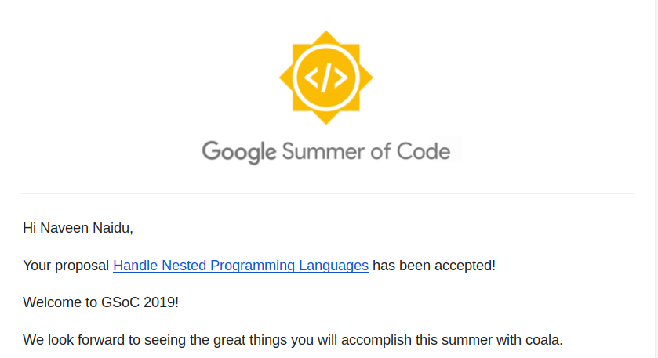

Yaaay! I was accepted as the Google Summer of code student at coala. I have been
waiting for this day for a long long time now (*Almost a year*).This can be
counted as one of my first big achievement so far :)


The project I got accepted is `Handling Nested Language`. This project is about
extending the functionality of coala to give it the support to run it's
analysis on files that contains nested languages (*Multiple languages in one file*
). I'll be implementing the architecture that will lay down the foundation for 
any future work. It kind of feels nice to say, that this very project has been
rejected thrice in the last three years, because no one was able to provide a 
proper way of acheiving it. *Hey Naveen, Stop Bragging :P*

### My Journey

I won't be going in detail about GSoC etc. There are many online resources out there. 
I'll be talking more about my journey to this phase. If I recall correctly,
it all started one year ago. It was in the month of January that I got to know
about the **term** Google Summer of Code via Quora(*Back in the day, quora
used to have nice articles*). I had no idea back then about,
what it actually was. I thought, that it was some internship
oppurtunity at Google. Oh! Boy, How wrong was I.

I am inquisitive by nature :see_no_evil:, I popped up my browser and started
googling about GSoC. I must admit at first shot, everything went above my head.
The only thing that stuck with me was that the stipend was 2400$ approx 1.64 Lakhs
in Indian Rupee. I was like:

<p align="center">
<div style="width:100%;height:0;padding-bottom:75%;position:relative;"><iframe src="https://giphy.com/embed/afjAKwdzH1KYU" width="100%" height="100%" style="position:absolute" frameBorder="0" class="giphy-embed" allowFullScreen></iframe></div><p><a href="https://giphy.com/gifs/pop-maximum-bits-afjAKwdzH1KYU">via GIPHY</a></p>
</p>

Well, everyone needs some motivation to actually carry out the task. So my 
motivation back then was *money*. I don't feel ashamed to admit it though.

So with the renewed motivation, I set out again to actually understand what it was.
I watched through various Youtube Videos and read through a lot of blogs and afer
2 days, I was able to comprehend all of it. I now understood, everything about
GSoC. And I decided that I'll give it a shot.

Mind you, back then I had zero to minus one level of experience in software 
development. *Not that I'm better now, I'm still a shit hole - Maybe a better
shit hole xD*. Money was a serious motivation to me back then. And I made a pact
with myself that I will give GSoC my best efforts.

All of this was during the mid January. In the next one week, I spent my entire
time learning git, github and setting up ubuntu on my laptop. Reviving those days,
I remember how lost I was. Git was something entirely new to me and It took me a
very very long time to get my head around it.

Anyway, by the last week of January - I had a basic idea of git and the workflow
of Github. The clock was ticking and it was time for me to choose my organisation.

And there I go to the organization's list and find that there were around 150+ 
orgs. I was SHOCKED!!!. All of the information on the pages were really 
overwhelming.

I randomly started selecting organisations, and trying them out. But most of the
organisations I choose were either very matured or the communications were cold.
I did not even know how to use a IRC back then and setting it up was another
nightmare. I dreaded Mailing Lists - I still do :P. And the conversations that
happened in the chat rooms of these organisations just went all over my head.
I wasn't able to soak in anything. I came across new terms every 10 minutes.


I started loosing interest. But I did not want to give up. I never was the one to
give up. I had one last scan on the Project Page, with a resolve of sticking with
the organisation and overcoming it's hurdles. This time I chose a non conventional
method. I started selecting the organisations by their logos xD

And amidts this pointeless quest of mine, I found my treasure. The cute coala bear.
The logo was really cute. I decided to check it out. The information about the
organisation wasn't very interesting to me back then :sweat_smile:, but I
anyway decided to lurk on their gitter channel. 

So, there I go, type in `Hello World` as mentioned in the Newcomer docs. And 
immediately I get treated by the corobo ( the chat bot for coala) with all 
the information. And it was then that I finally fell in love with that organisation.

And the rest is history (*I'll explain about what happened after that in some other
post later*).

```
TL;DR - I started contributing to coala. The community is just awesome. 
Could not get in that year. Stuck around. Contributed more. Got bashed. 
Primary Motivation changes from Money to Fun. Got appreciated. 
Got invited  to become a Google Code In Mentor. Got bashed again. 
Had fun helping students fix their bug. Started working on my proposal. 
The community was dead for  some time. Maintainer  were busy with 
their work.  Spent loads of time on preparing the proposals. Made 
the draft. Submitted. Got accepted :)
```

There's a lot more spice to it. I'll talk about it in a later post :)

### What's next?

The current month is allocated for Community Bonding Period, where I meet my 
mentors, get acquainted with them, prepare a proper understanding of my project
and refine the timelines.

The next month will be a challenge to me as I would be having my College finals
starting from June 13 to July 3rd. It's going to be tough! but I love it this way
:)

### Thanks! people!

This blog post was intended to thank everyone involved. Special thanks goes to 
Mischa Kruger, without him - I would never have been able to make a proposal.
He helped me clear all my doubts and helped me lay the first basic foundation
of the project. I will always be indebted to him.

I would also thank Dong he naa, Virresh and Saurav - without their valuable inputs
, My proposal would have been filled with lot's of loopholes.

I also would like to thank My Parents, My Brother and My Roomates - Naren(*Soon to be my Ex-Roomate*) and Amit,
for being there when I needed them and for all their support :)

<p align="center">
<div style="width:100%;height:0;padding-bottom:56%;position:relative;">
	<iframe src="https://giphy.com/embed/3oz8xIsloV7zOmt81G" width="100%" 
	height="100%" style="position:absolute" frameBorder="0" class="giphy-embed" 
	allowFullScreen></iframe>
</div>
<p>
		<a href="https://giphy.com/gifs/arg-thank-you-cat-3oz8xIsloV7zOmt81G">via GIPHY</a>
</p>
</p>

