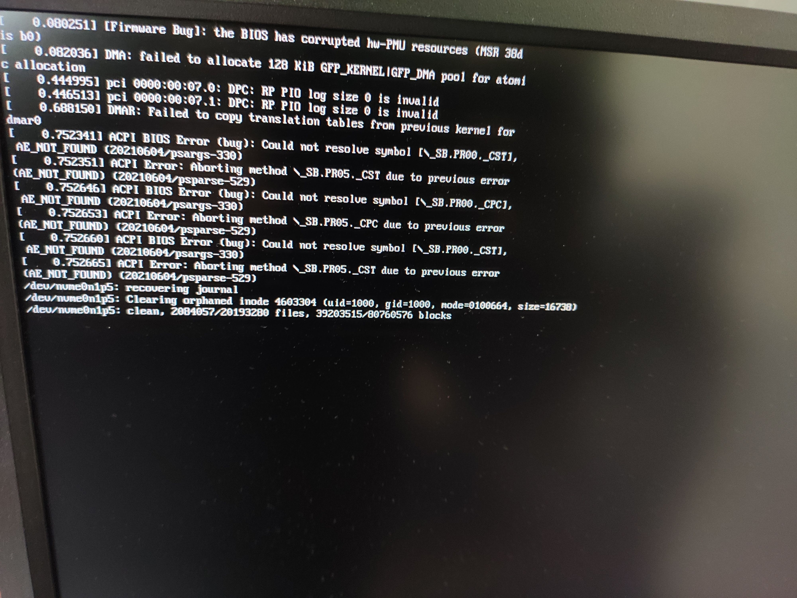

Hallo Robots o/

I was feeling a bit adventurous today so I wanted to go ahead and try to panic
the kernel. I mean, the Linux Kernel is so robust that I have never seen it
panic until now in normal day to day usage, but I am wondering what does it
look like when kernel does panic 🎃

> NOTE: Running the following codes, WILL CRASH YOUR SYSTEM. An easy poweroff
> poweron should fix it though :)

There are two way that I was able to figure out, which can help us panic our
kernels.

### 1. Using panic() from a custom kernel module

In this approach, we will create a custom kernel module and use the kernel's
`panic()` function to panic the kernel. 

##### 1. Set things up

```bash
mkdir panic-module
cd panic-module
touch panic.c Makefile
```

#### 2. Create the custom kernel module 

```c
/*
 * panic_module.c -- A Kernel module that panics the kernel
 */
#include<linux/init.h>
#include<linux/module.h>
#include<linux/panic.h>

static int __init panic_module_init(void)
{
	printk(KERN_INFO KBUILD_MODNAME ": Panic Module Init.\n");

    /* Panic the kernel using the panic() function */
    panic("panic_module: Kernel panicked due to panic().\n");

	printk(KERN_INFO KBUILD_MODNAME ": Panic module: %d\n", y);

	return 0;
}

static void __exit panic_module_cleanup(void)
{
	printk(KERN_INFO KBUILD_MODNAME ": Panic Module Cleanup.\n");
}

/* Register the module */
module_init(panic_module_init);
module_exit(panic_module_cleanup);

/* Information regarding the module */
MODULE_LICENSE("GPL");
MODULE_AUTHOR("Naveen Naidu");
MODULE_DESCRIPTION("A Kernel Module to panic te kernel");
```

#### 3. Create our Makefile

```Makefile
obj-m := panic_module.o
KDIR := /lib/modules/$(shell uname -r)/build

all:
	$(MAKE) -C $(KDIR) M=$(PWD) modules
clean:
	$(MAKE) -C $(KDIR) M=$(PWD) clean
```

#### 4. Time to panic the kernel

Now that we have everything set up, let's go panic the kernel :D

> **WARNING**: DOING THE FOLLOWING WILL CRASH THE KERNEL, SAVE EVERYTHING BEFORE TRYING
> Restarting the system will fix everything :)

```bash
cd panic-module
make all
sudo insmod panic_module
```

TADA! Your kernel has crashed :P 

-------
-------

### 2. Panicking the kernel using CONFIG_PANIC_ON_OOPS

I was wondering if there were any other ways using which we could panic the 
kernel.

After a bit of creative searching :P, I figured that kernel has a configuration
option called as
[CONFIG_PANIC_ON_OOPS](http://lkml.iu.edu/hypermail/linux/kernel/1301.2/04176.html)
which will panic the kernel whenever any OOPS happens.

So I was wondering, if we switch on these options, and make our `panic-module.c`
file create an OOPS instead of using the `panic()` then we can cause the panic.

And guess what! That does indeed work \o/

But! Note that for this to work, you would have to compile the mainline kernel
with  `CONFIG_PANIC_ON_OOPS_VALUE=1` and `CONFIG_PANIC_ON_OOPS=y` and boot into
that kernel and then load the following module. 

This is a very time intensive work though :(

But for the highly motivated, I'll still provide the updated `panic_module.c` 
file :)

```c 
/*
 * panic_module.c -- A Kernel module that panics the kernel
 */
#include<linux/init.h>
#include<linux/module.h>
#include<linux/panic.h>

static int __init panic_module_init(void)
{
	printk(KERN_INFO KBUILD_MODNAME ": Panic Module Init.\n");

	/* Panic the kernel by dereferencing a NULL pointer.
	 * Note that, this would only cause an OOPS. To panic the kernel on OOPS
	 * you would also have to set `CONFIG_PANIC_ON_OOPS=y` and set the
	 * `CONFIG_PANIC_ON_OOPS_VALUE=1`.
     */
	int *p = NULL;
	int y = *p;

	printk(KERN_INFO KBUILD_MODNAME ": Panic module: %d\n", y);

	return 0;
}

static void __exit panic_module_cleanup(void)
{
	printk(KERN_INFO KBUILD_MODNAME ": Panic Module Cleanup.\n");
}

/* Register the module  */
module_init(panic_module_init);
module_exit(panic_module_cleanup);

/* Information regarding the module */
MODULE_LICENSE("GPL");
MODULE_AUTHOR("Naveen Naidu");
MODULE_DESCRIPTION("A Kernel Module to panic te kernel");
```

Once you make the above module using the Makefile provided in the Approach 1,
and insert the module. You'll observe something like the following:



-----
-----

That's it for now folks! <br />
`:wq`

---

import Comments from '../../components/Comments';

<Comments
  post={{
    identifier: 'hello-world',
    
  }}
/>