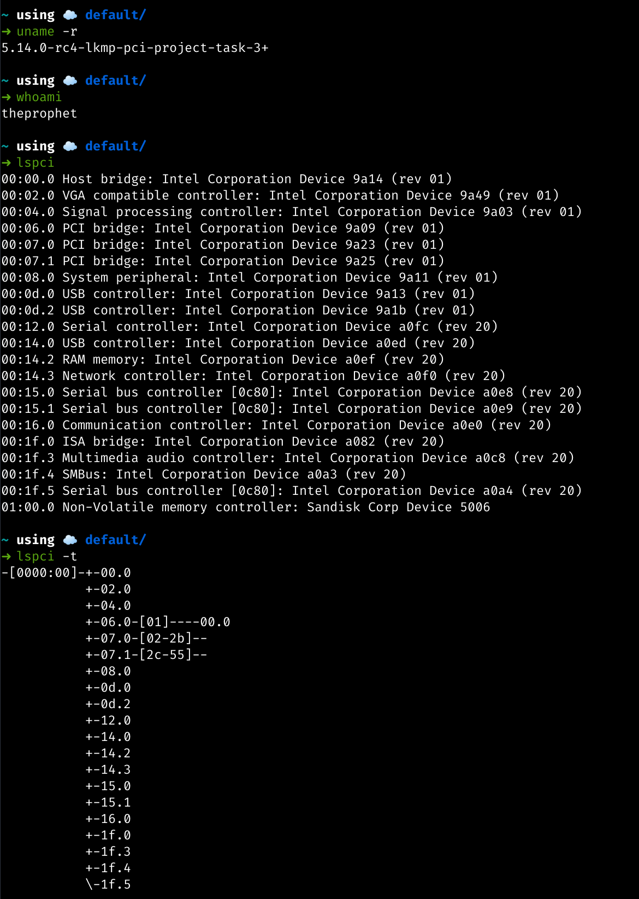
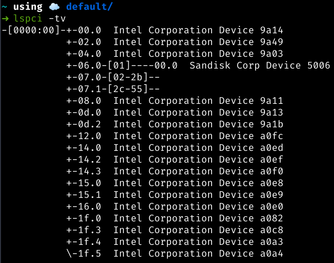
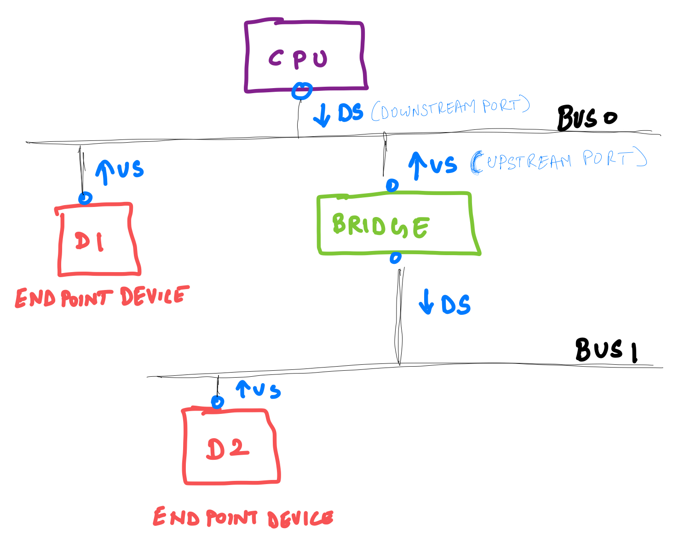
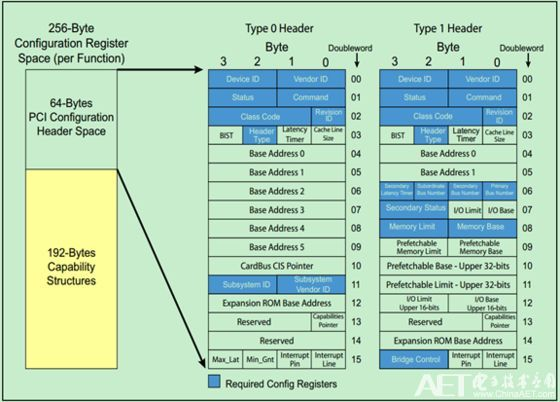
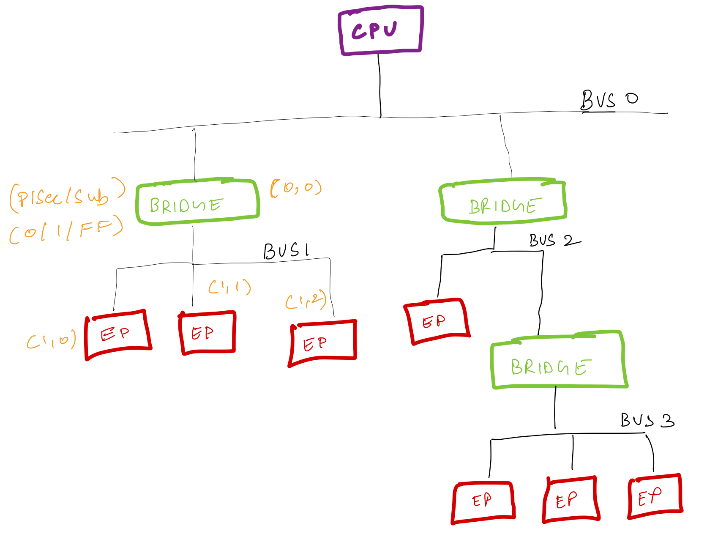
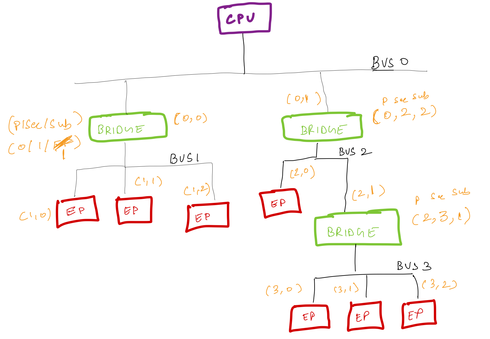

Cheerio hoomans o/

Today we'll have a very brief intro what PCI is all about. PCI as such is a 
very vast specification and I honestly, there are still a lot of things I do
not understand. So let's start with the basic for now and as and when I get more
time I'll keep writing more blogs :)

Why am I reading/writing about PCI, Welll because that's the subsytem I'll be
working with during my Linux Kernel Mentorship under Bjorn Helgaas :)


## Brief Overview

-------
-------

PCI stands for Peripheral Component Interconnect. This was introduced in 1993 by
the Intel Corporation. A PCI device is any computer hardware that plugs directly
into a PCI slot on a computer hardware.

### How to find PCI devices in the system

We can use the `lspci` tool to list all PCI devices. This tool is part of the
PCI Utilities ([pciutils](https://github.com/pciutils/pciutils)) package created by Martin Mares. 

lspci utility is used to display information about the PCI buses present in the
system and devices connected to them.

-----

#### lspci options 

- `lspci`   : Show a brief list of devices
- `lspci -v`: Display additional info
- `lspci -t`: Display devices in a tree like manner
- `lspci -k`: Display drivers and modules handling each device
- `lspci -s {{00:18.3}}`: Show a specific device
- `lspci -vm`: Dump info in a readable form

-----

#### PCI Device list in my system



In the above image we can see that each device in the list has a unique number.
The unique number format is as follows:

```
(BB:DD.F) == (Bus Number :: Device Number . Function Number)
```

For eg: The VGA compatible controller has the unique ID of (00::02.0), this
means that the VGA compatible controller is present on Bus Number 0, and the
device number for this is 1 and the function number is 0.



Similarly if you see the above image with lspci tree, the device with unique id
(00::06.0) which is the *PCI bridge: Intel Corporation Device 9a09 (rev 01)* is a
Bridge Device and to this bridge, the device (01::00.0) which is the Sandisk
Corp Device 5006 is connected. We’ll learn more about how the addressing of
devices happens below.

-------
-------

## Detailed Summary

### What is a Peripheral Component Interface

PCI is a local computer bus for attaching hardware devices in a computer and is
part of the PCI Local Bus standard. The major advantage of PCI is that the bus
supports the functions found on a processor bus in a standardized format and is
independent of any given processor’s native bus. This helps because we no longer
need to worry about a device not being able to work natively with another
processor. 

It is a replacement for the ISA (Industry Standard Architecture) standard and
has three main goals:

1. Higher data transfer speed between computer and its peripherals.
2. Platform independent
3. Easy addition and removal of devices

-----

### PCI Addressing

PCI supports 3 address spaces:

1. **PCI Configuration space** - Use this space to configure the device. The
information present here, will be used by the software to determine the amount
of memory and I/o address space needed by the device

2. **Input Output Space (I/O space)** - Used for data transfer between CPU and PCI
device

3. **Memory Address Space** - Could either be MMIO (*Memory Mapped IO*) or PIP
(*Port Mapped IO*) - Use to store data on the PCI device

When we say that PCI supports 3 address space, it means that each PCI device
that is connected to the PCI Bus is allocated an address space. That allocated
address space can then be divided into 3 different spaces i.e the configuration
space, I/O address and Memory address space. 

For eg: Say a CPU wants to configure a PCI device it will write into the
configuration address space of the device.

Each PCI peripheral is identified by a *bus number*, a *device number*, and a 
*function number*. 

The PCI specification states that:

1. The system can host up to 256 buses (8 bit)
2. Each bus can hosts up to 32 devices (5 bit)
3. And Each device can be a multifunction board i.e it can have 7 functions (3
bit)

Thus, each PCI device can be identified at hardware level by their 16-bit
address, or unique key.

-----

### Types of devices

There can be three types of devices in the PCI.

1. **Root Complex (CPU)** - This device only has the downstream port
2. **Bridge Devices** - This device is used to connect two different buses and 
has both upstream port and downstream port.
3. **End Point Devices** - This is the actual device to which data is sent to 
and from the CPU. Kinda like leaf nodes of a tree. This device only has an
upstream port.



The configuration space of the PCI devices are of two types:
1. Type 0 - Headers of End Point devices
2. Type 1 - Headers of Bridge devices



[Image Ref](https://www.programmersought.com/article/80536175488/)

The registers marked in `Blue` are mandatory. It is from these registers the
`lspci` tool fetches it’s information from.

-----

### Boot Time

To learn how PCI works, we’ll have to start from what happens when a system
boots.

When power is applied to a PCI device, the hardware remains inactive. That
means, the device will only respond to configuration transactions. When the
power is just applied, the device has no memory and no I/O ports mapped in the
computer’s address space.

Since every PCI motherboard is equipped with PCI-aware firmware, called the BIOS
- The firmware gives the feasibility to access the device configuration address
space by reading and writing registers in the PCI controller. That means, the
CPU can figure out what devices are connected to the PCI motherboard, by writing
into the special register on the controller which will then begin the probing of
devices if I may use the term probe.

To summarize, the firmware (or operating system) queries all PCI buses at
startup time (via PCI Configuration Space) to find out what devices are present
and what system resources (memory space, I/O space, interrupt lines, etc.) each
needs. It then allocates the resources and tells each device what its allocation
is. By the time a device driver accesses the device, its memory and I/O regions
have already been mapped into the processor’s address space.

------

### PCI Bus Enumeration



The Bus that starts from the CPU is always given the number zero (0). And the
rest of the bus that gets created using PCI bridge are given number starting
from one (1).

Before we proceed further let’s talk about few terms:

1. **Primary Bus Number** : The bus number immediately upstream of the PCI-PCI
Bridge.
2. **Secondary Bus Number** : The bus number immediately downstream of the
PCI-PCI Bridge.
3. **Subordinate Bus Number** :  The highest bus number of all of the busses
that can be reached downstream of the bridge.

Each Bridge is associated with three number: (Primary Bus Number/ Secondary Bus
Number / Subordinate Bus Number) or (P/Sec/Sub)

Let’s take the above image to look into how PCI Bus Enumeration happens.

The configuration cycle starts when the system is booted up. During this
configuration cycle, the PCI devices have no address mapped so  the BIOS issues
IDSEL (Individual Device) signal on the Bus 0 to configure the device.

When the signal comes to the first device, it gets the header type from the
device and finds that it is `Type 1` which means  a PCI Bridge Device. And since
it is a PCI Bridge Device is given the unique ID of (0::0) because the Bus
number is 0 and it is the first device in the bus. Also the (P/Sec/Sub) is tuple
set to (0/1/FF). The Primary number is `0` because the immediate upstream bus to
the device is Bus 0. And since it’s a bridge device, we move down and the number
of that bus will be given as 1. And hence the Secondary Number of that bridge is
given as `1` and since we do not yet know the highest number of all the buses
that can be reached downstream of the bridge, the Subordinate Bus Number is
assigned to the highest bus number which is 255 or FF.

Moving down the device (0,0) we reach the bus number (1). And then the software
starts checking each of the devices. The first device is an edge device and
since there will be no bus below it, the number (1::1) is assigned. Because the
bus number where the device is 1 and the device number is 1. Similarly since all
the devices connected to the Bus Number 1 are Endpoint devices, the unique id
given to them are (1,1) and (1,2). The signal is then polled until 31 because
each bus can have 31 devices. If no devices are found then it returns back to
the bridge above it.

Now that we revisit Bridge 0, it is time to update the `Sub` field of  the
(P/Sec/Sub) tuple. The software sees that there was only 1 bus below the device
and thus updates the `Sub` value from FF to 1. Therefore the final (P/Sec/Sub)
value becomes (0/1/1)

Similarly, following the above procedure, the signal reads each device present
on the bus, gets the information about them and assigns the required memory
space of each device. Following is what the final unique ID of each device will
look like:



-----
-----

That's a very brief intro to PCI devices folks. I'll keep updating this post as
and when I understand more about it :)

Ciao for now!
Tata o/

---

import Comments from '../../components/Comments';

<Comments
  post={{
    identifier: 'hello-world',
    
  }}
/>