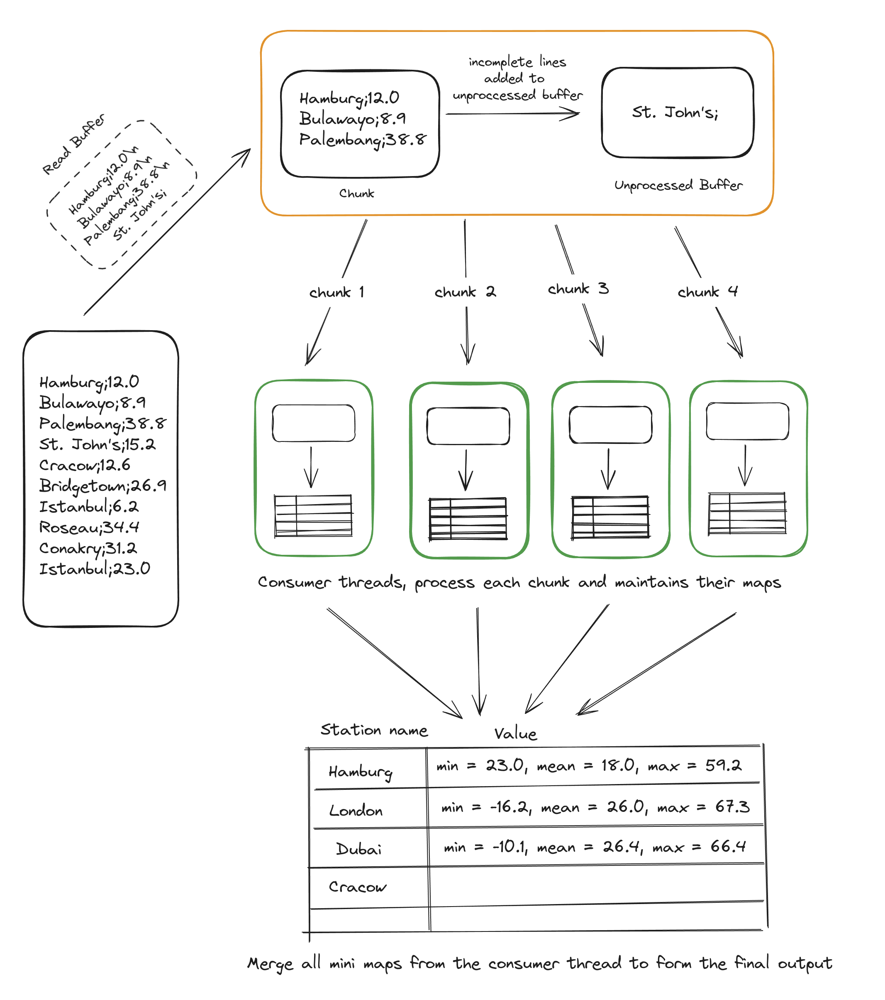
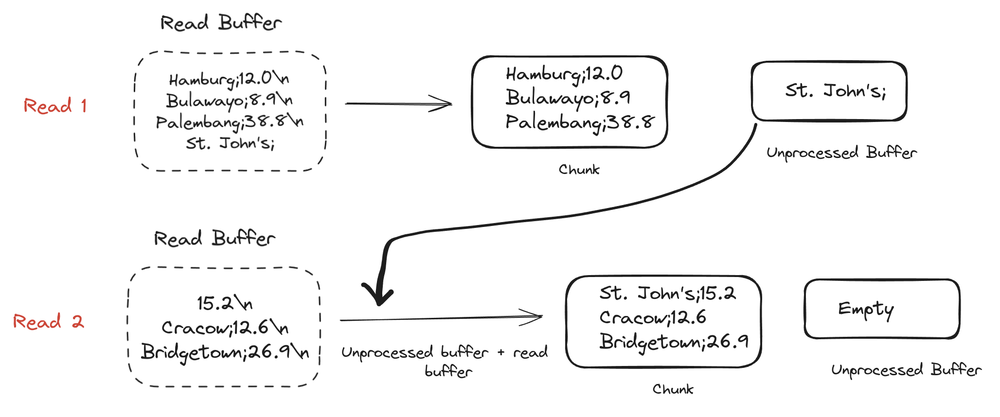
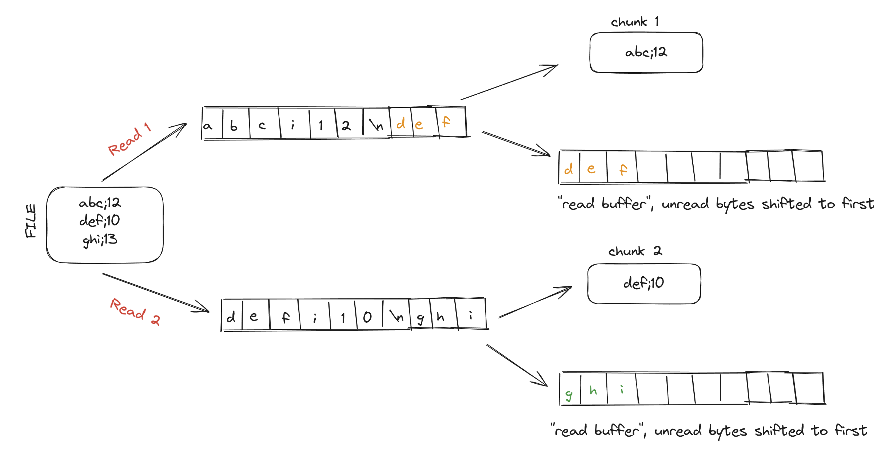

Heyo folks!

This blog talks about my journey of tackling the [1 Billion Row
Challenge](https://github.com/gunnarmorling/1brc) (1BRC) and the insights I
gained along the way.

It all began when [Shraddha](https://x.com/shraddhaag) introduced me to this
challenge through her implementation in Go. (Seriously, if you haven't read her
[article](https://www.bytesizego.com/blog/one-billion-row-challenge-go) yet, go
check it out!) Her work sparked my curiosity: How would this challenge play out
in Rust? More importantly, how would the mental model shift when switching
languages?

I started out with a humble 5 minute execution time and was able to bring it
down to 9 seconds \o/. That's right - we're talking about a speedup of over 33x!
But the numbers only tell part of the story. The real adventure was in the
learning, the optimizations, and the "aha!" moments along the way

## What is the 1 Billion Row Challenge?

**Input**: A 14 GB text file containing 1 billion rows of temperature
measurements from various weather stations. Each line has the format 
`<string: station name>;<double: measurement>`

**Output**: An alphabetically sorted list of cities with their temperature statistics, formatted as: 
`{city1=<min>/<mean>/<max>, city2=<min>/<mean>/<max>, ...}`

#### Why is this challenging?
The sheer volume of data - one billion rows - makes this task non-trivial.
Processing such a large dataset quickly requires careful consideration of
various constraints. Plus, let's face it - there's something alluring about
conquering a "billion" of anything!

#### My additional rules
While adhering to the [official rules](https://github.com/gunnarmorling/1brc), I set some personal challenges:

1. Achieve single-digit runtime (why? because I love challenges :P)
2. No unsafe code (safety first!)
3. Simple, maintainable code (testing the "dumb code is the best code" theory)

### Tools and Links

Links:
* My code: https://github.com/Naveenaidu/rust-1brc

Tools:
* System: Apple M1 Pro (2021 model, 16GB memory, 10 vCPU)
* Language: Rust 1.77.0

### Breaking Down the Challenge: A Preliminary Assessment

Before diving into the challenge, it's crucial to break down the problem into
manageable sub-tasks. At a high level, we're facing three main challenges:

1. Reading a 14 GB file efficiently
   * Read the entire file at once?
   * Read the file in a streaming manner (in chunks)
2. Choosing the right data structure to store and process the information
   * The task requires us to quickly look up temperature data for a given
     station name, avoid duplicating station names and efficiently update min,
     max and mean. HashMap is the right fit for these conditions
3. Processing the data effectively
    * This is where the real challenge lies, As we progress through the
      implementations - we’ll explore various optimizations techniques to
      address this challenge

----

## Initial solution: 253s

Commit Link:
[Commit](https://github.com/Naveenaidu/rust-1brc/commit/455609a22e844759779a0a2c152047a8dfe0c981)

The first attempt at this challenge was done in the naivest way possible. Here's how it worked:
1. Read the entire file into a `String`
2. Iterate through the new lines:
    * Parse the line to get the station name and value
    * Make this entry to the hashmap
        * If an entry already exists, update the values. 
3. Transfer data to a `BTreeMap` for sorted output.

```rust
struct StationValues {
    min: f32,
    max: f32,
    mean: f32,
    count: u32,
}

// Parse line, to extract StationName and the value
fn read_line(data: String) -> (String, f32) {
    let parts: Vec<&str> = data.split(';').collect();
    let station_name = parts[0].to_string();
    let value = parts[1].parse::<f32>().expect("Failed to parse value");
    (station_name, value)
}

// Calculate the station values
fn calculate_station_values(data: String) -> HashMap<String, StationValues> {
    let mut result: HashMap<String, StationValues> = HashMap::new();
    for line in data.lines() {
        let line = line.trim();
        let (station_name, value) = read_line(line.to_string());
        result
            .entry(station_name)
            .and_modify(|e| { ... })
            .or_insert(StationValues { ... });
    }

    result
}
```

### Flamegraph Analysis

Flamegraph:
[Flamegraph](https://github.com/Naveenaidu/rust-1brc/blob/main/flamegraphs/01-Naive-Implementation/flamegraph.svg)
(*Download and Open in a new tab to see the interactive version*)

The flamegraph reveals that:
* 45% of execution time is in the `read_line` function.
* Within read_line:
    * 22% in `collect()`
    * 10% in `parse()`
    * 4% in `to_string()`


The flamegraph shows that the `collect()` calls invoke malloc system calls. This
means, for each of our billions lines, we're allocating memory on heap,
processing it and immediately discarding this memory. This unnecessary
allocation and deallocation seems like a performance bottleneck.

The reason I used a vector is to easily access the station names and its values
by index. However, we can achieve the same result more efficiently: 
* Instead of `collect()`ing into a vector, we can use the iterator returned by
`split()` directly. 
* Use `next()` to access elements, avoiding allocation altogether. This
realisation sets the stage for our next optimization attempt.

#### Bloopers
I had a couple of “face palm” moments when trying to calculate the execution time for this solution:

1. Forgot the `--release` flag:
    * I ran the solution without the --release flag, resulting in a staggering
      30-minute execution time. This totally threw me off!
    * Adding the --release flag reduced the time to about 20 minutes. This still
      seemed on a bit higher side P_P
    * Always use the --release flag for performance testing. Debug builds in Rust
      include many checks and lack optimizations, making them significantly slower.
2. `println!` in the hot path:
    * I had a `println!` statement inside the read_line function, which
      processes the billion lines.
    * Apparently, each `println!` makes a [system
      call](https://www.reddit.com/r/rust/comments/vvog9m/need_explanation_of_print_behavior/).
      When placed in a loop iterating a billion times, this results in a billion
      system calls, dramatically slowing down execution. Always be cautious
      about I/O operations in hot paths. 
    * Removing the println! from the hot path the execution time is 253 seconds.

----

## Step 2: No redundant vector creation (241s)
Commit Link: [Commit](https://github.com/Naveenaidu/rust-1brc/commit/fb2dda8491d40630bb20437483b76f80ee1145f8)

In this iteration, I focused on removing unnecessary allocations during line
parsing. Replacing the vector-based parsing with a more efficient iterator
approach `next()` shaved off 12 seconds from our execution time.

```rs
fn read_line(data: String) -> (String, f32) {
	let mut parts = data.split(';');
	let station_name = parts.next().expect("error");
	let value = parts.next().expect("error").parse::<f32>().expect("error");
	(station_name.to_owned(), value)
}
```
### Flamegraph Analysis

Flamegraph:
[Flamegraph](https://github.com/Naveenaidu/rust-1brc/blob/main/flamegraphs/02-Use-iterator-instead-of-collect-read-line/flamegraph.svg)
(*Download and Open in a new tab to see the interactive version*)

The flamegraph verifies that the `read_line` now consumes only 35% of execution
time, down from 45% in the previous iteration.

#### Current Implementation

```rs
fn calculate_station_values(data: String) -> HashMap<String, StationValues> {
	for line in data.lines() {
    	let (station_name, value) = read_line(line.to_string()); ← Problem ??
    	// ... process data ...
	}
}

fn main() {
	let data = std::fs::read_to_string(args.file).expect("error"); ← Problem ??
	let result = calculate_station_values(data);
	// ... output results ...
}
```

**New Observations and Hypotheses:**
1. `read_to_string` takes 1.05% of the execution time.
2. `to_string` accounts for 8% of the time.

**Potention Issues:**
1. **Large Memory Allocation**: `read_to_string` allocates memory [equivalent to
   the file](https://doc.rust-lang.org/src/std/fs.rs.html#308) size (14GB). This
   large allocation is inefficient and may not be feasible on systems with
   limited RAM.
2. **String to &str Conversion**: The `lines()` method returns string slices
   (`&str`), but we often need owned Strings for manipulation. This necessitates
   `to_string()` calls, leading to more allocations

### Next Steps

To address these issues, we should consider:
1. Reading the file in smaller chunks to reduce memory usage.
2. Using an interface that provides owned `Strings` directly, avoiding
`to_string()` conversions. 

`BufReader` seems like a promising solution to both these problems. It allows for
efficient, chunked reading and can be configured to work with owned `Strings`
directly.

----

## Step 3: Use BufReader (137s)

Commit Link: [Commit](https://github.com/Naveenaidu/rust-1brc/commit/1f411b68b3c711dbe3ddd32c32c0247f5d61e322)

In this iteration, we replaced read_to_string with BufReader, resulting in a
reduction of almost 100 seconds in execution time. This change validates our
hypothesis about BufReader's efficiency for large files. Paraphrasing the
[reddit
comment](https://www.reddit.com/r/learnrust/comments/154cf2y/comment/jsocj6h/?utm_source=share&utm_medium=web3x&utm_name=web3xcss&utm_term=1&utm_content=share_button)
below:

> System calls involve doing a [bunch of
work](https://www.oreilly.com/library/view/understanding-the-linux/0596005652/ch16s01.html)
to prepare to hand over control to the operating system so that it can do the
read operation. That work is the same regardless of the amount of data that is
being read. read_to_string is very efficient in terms of the number of system
calls but it comes with the downside of a lot of unnecessary memory use and
necessitates redundant allocation of owned String for each line, only to discard
it later.
>
> BufReader is intended to be a middle ground without excessive memory usage or
excessive system calls. BufReader makes it so that the system calls always read
a lot at a time even when you only ask for a little bit of data, so that when
you ask for the next little bit of data it doesn't need to go through the work
all over again

**Lessons**
1. BufReader is better when dealing with larger files.
2. `read_to_string` is very convenient for smaller files, or when ownership of
   the entire data isn't required.
3. This
   [table](https://users.rust-lang.org/t/why-using-the-read-lines-iterator-is-much-slower-than-using-read-line/92815/7)
   captures the strengths and weaknesses of different approaches when dealing
   with files.

### Flamegraph Analysis

Flamegraph:
[Flamegraph](https://github.com/Naveenaidu/rust-1brc/blob/main/flamegraphs/03-use-buffreader/flamegraph.svg)
(*Download and Open in a new tab to see the interactive version*)

Let's take a diversion and look at how the numbers are being processed. The
flame graph reveals that about 13% of the execution time is spent converting
strings to floats. I recall reading through a
[post](https://www.reddit.com/r/rust/comments/9vdsyl/rust_float_parsing_is_atypically_slow/)
which talked about how rust float parsing is slow, maybe we should try a faster
float parsing crate.

----

## Step 4: Faster float parsing (134s)

Commit Link: [Commit](https://github.com/Naveenaidu/rust-1brc/commit/df29672ee4962a931800a06b005e03020b150e9b)

Flamegraph:
[Flamegraph](https://github.com/Naveenaidu/rust-1brc/blob/main/flamegraphs/04-use-fast-float-SIMD/flamegraph.svg)
(*Download and Open in a new tab to see the interactive version*)

Using the [fast-float](https://docs.rs/fast-float/latest/fast_float/) crate to
parse the strings as floats have helped reduce the execution time by 4 seconds.
Not a huge improvement, but I'll take what I can get :)

Interestingly, reading through the fast-float github repo, I see that the
techniques used in this repository have now been
[merged](https://github.com/rust-lang/rust/pull/86761) into the std core's parse
method. Then why did we get the extra 4s reduction. This
[comment](https://github.com/rust-lang/rust/pull/86761#issuecomment-873695763)
clears up the air:

> Why do real-case benchmarks favour core, while the single float tests favour
> fast-float-rust? It might be due to the very aggressive inlining in
> fast-float-rust.

----

## Step 5: Better Hashing Algorithm (123s)

Commit Link: [Commit](https://github.com/Naveenaidu/rust-1brc/commit/afc73a15857f06e30bb493e492089202bb3d3b57)

This improvement was just sheer luck and some RTFM skills. While reading through
Rust float parsing I came across this
[Hashing](https://nnethercote.github.io/perf-book/hashing.html) page. The lead
me to read the manual for the Rust
[Hashmap](https://doc.rust-lang.org/std/collections/struct.HashMap.html)  which
mentions that:

> The default hashing algorithm is currently SipHash 1-3, though this is subject
> to change at any point in the future. While its performance is very
> competitive for medium sized keys, other hashing algorithms will outperform it
> for small keys such as integers as well as large keys such as long strings,
> though those algorithms will typically not protect against attacks such as
> HashDoS.

The [SipHash 1-3](https://en.wikipedia.org/wiki/SipHash) algorithm is high
quality—it provides high protection against collisions—but is relatively slow,
particularly for short keys such as integers. The [Rust Performance
Book](https://nnethercote.github.io/perf-book/hashing.html) suggested the usage
of `FxHashMap` from the [rustc_hash](https://docs.rs/rustc-hash/2.0.0/rustc_hash/)
crate and I ended up using it.

This reduced 11 seconds from the execution time. [Looks
like](https://www.reddit.com/r/rust/comments/52grcl/comment/d7kcei2/?utm_source=share&utm_medium=web3x&utm_name=web3xcss&utm_term=1&utm_content=share_button)
rust prefers security over performance.

### Flamegraph Analysis

Flamegraph:
[Flamegraph](https://github.com/Naveenaidu/rust-1brc/blob/main/flamegraphs/05-use-Fxhashmap/flamegraph.svg)
(*Download and Open in a new tab to see the interactive version*)

Inspired by past approaches, I was looking for any redundant memory allocations.

The process of reading a line from the BufReader in the `calculate_station_values`
method was contributing to some memory allocations. This is because the `lines`
method on the Bufreader allocates a new `String` per line, this is wasteful as we
drop these strings immediately after use.

The efficient way to read the lines would be to maintain one single String
buffer and use that to store each line we process. This way we only allocate
memory for one String buffer.

----

## Step 6: Use read_line on BufReader (105s)

Commit Link: [Commit](https://github.com/Naveenaidu/rust-1brc/commit/d4b60cfe8ba58804b45a896e4bd5230cfeb8596d)

Flamegraph:
[Flamegraph](https://github.com/Naveenaidu/rust-1brc/blob/main/flamegraphs/06-use-read_line/flamegraph.svg)
(*Download and Open in a new tab to see the interactive version*)

The `read_line`
[method](https://doc.rust-lang.org/std/io/trait.BufRead.html#method.read_line)
on the Bufreader takes all bytes until a newline (the 0xA byte) is reached, and
appends them to the provided String buffer. This helped us reduce the time by 18
seconds.  The caveat with this solution is that we have to manually manage the
buffer but we aren’t looking for ergonomy here.

```rs
fn calculate_station_values(reader: &mut BufReader<File>) -> FxHashMap<String, StationValues> {
    let mut buf = String::new();

    while let Ok(bytes_read) = reader.read_line(&mut buf) {
        if bytes_read == 0 {
            break;
        }
        let line = buf.trim();
        let (station_name, value) = read_line(line);
        ....
        buf.clear();
       ....
    }
....
}
```

Dealing with buffers made me realise that we have been playing with Strings till
now. And Strings in Rust are UTF-8 encoded - this means we are incurring an
overhead of validation everytime we read a String. Since we know that the file
we are dealing with is a valid UTF-8 encoded file, I think we can eliminate this
check entirely. The idea being, instead of storing the data on String, we
directly use bytes!

----

## Step 7: Use bytes instead of Strings (83s)

Commit Link: [Commit](https://github.com/Naveenaidu/rust-1brc/commit/2bc8cc3c53909d9889c7a9de2a430a982bb3533b)

Bufreader has a read_until method which takes a byte limiter (`\n`) and a `&mut
Vec<u8>` buffer. The reader reads through the file and keeps pushing the data
into the buffer as long as we keep calling the method. We also change the type
of the Station Name in our hashmap to be a `Vec<u8>` instead of String. These
two changes effectively remove the String from the code.

These changes have given us some significant gains, we reduced our execution
time by almost 22 seconds.

```rs
fn calculate_station_values(reader: &mut BufReader<File>) -> FxHashMap<Vec<u8>, StationValues> {
    let mut result: FxHashMap<Vec<u8>, StationValues> = FxHashMap::default();
    let mut buf = Vec::new();

    while let Ok(bytes_read) = reader.read_until(b'\n', &mut buf) {
       if bytes_read == 0 {
            break;
        }
        // remove new line character
        buf.truncate(bytes_read - 1);
        
        // read_line allocates a new vector to store station_name
        let (station_name, value) = read_line(&buf);

       buf.clear()
    }
 ...
}

fn read_line(data: &Vec<u8>) -> (Vec<u8>, f32) {
    let mut parts = data.rsplit(|&c| c == b';');
    ....
    (station_name.to_vec(), value)
}
```

### Flamegraph Analysis

Flamegraph:
[Flamegraph](https://github.com/Naveenaidu/rust-1brc/blob/main/flamegraphs/07-use-bytes-instead-of-string/flamegraph.svg)
(*Download and Open in a new tab to see the interactive version*)

The flamegraph shows that we traded String allocation with Vector allocation
(notice the `to_vec` in `read_line`). We did receive a performance boost because we
are no longer validating UTF8 encoding. The interesting question to ask is: 
**Can we avoid any allocation happening altogether and directly use bytes?**

----

## Step 8: Memory Map (78s)

Commit Link: [Commit](https://github.com/Naveenaidu/rust-1brc/commit/38bdd0131d320b9ed92a2bfa3c86d00796c1c95f)

The [memmap2](https://docs.rs/memmap2/latest/memmap2/) crate provides us a nice
interface to the file and gives us a `&[u8]` reference to deal with. In this step,
we replaced the method of reading a file using Streaming access (BufReader) to
using RandomAccess (mmap). This way we transfer the responsibility to the OS and
let it deal with paging mechanisms etc

Memory map helped reduce the execution time by 5 seconds. Mmap has also helped
in avoiding any extra allocation.

```rs
fn calculate_station_values(data:&[u8]) -> FxHashMap<&[u8], StationValues> {
    ....
}

fn read_line(data: &[u8]) -> (&[u8], f32) {
    let mut parts = data.rsplit(|&c| c == b';')
    ...
}

fn main() {
    let file = std::fs::File::open(&args.file).expect("Failed to open file");
    let mmap = unsafe { Mmap::map(&file).expect("Failed to map file") };
    let data = &*mmap;
    let result = calculate_station_values(data);
    ....
}
```

### Flamegraph Analysis

Flamegraph:
[Flamegraph](https://github.com/Naveenaidu/rust-1brc/blob/main/flamegraphs/08-use-mmap-byte-everywhere/flamegraph.svg)
(*Download and Open in a new tab to see the interactive version*)

The split function that we use in `calculate_station_values` and `read_line` seems
to take 13% and 11% of the execution time respectively. These areas present our
next optimization targets.

I am unhappy with the usage of unsafe code here, but let’s plough through this
hope that I get inspiration later.

----

## Step 9: Optimising Byte Searches with SIMD (71s)

Commit Link: [Commit](https://github.com/Naveenaidu/rust-1brc/commit/d24e56fefb699fa953def653d53efd9d6b611139)

In this step, we ventured into SIMD (Single Instruction, Multiple Data)
territory to optimise our byte searching process. Instead of using `split()` to
get an iterator with lines, we are going to loop through the bytes and use the
heavily optimised `memchr` crate to search the new line character. This helped us
shave off 7 seconds.

```rs
// Eg: data looks like "Hamburg;19.8\n"
fn calculate_station_values(data:&[u8]) -> FxHashMap<&[u8], StationValues> {
    let mut result: FxHashMap<&[u8], StationValues> = FxHashMap::default();
    let  mut buffer = data;
    loop {
        match memchr(b';', &buffer) {
            None => {
                break;
            }
            Some(comma_seperator) => {
                let end = memchr(b'\n', &buffer[comma_seperator..]).unwrap();
                let name = &buffer[..comma_seperator];
                let value = &buffer[comma_seperator+1..comma_seperator+end];
                let value = fast_float::parse(value).expect("Failed to parse value");

                ....
                buffer = &buffer[comma_seperator+end+1..];
            }

    }
}
```

### Flamegraph Analysis

Flamegraph:
[Flamegraph](https://github.com/Naveenaidu/rust-1brc/blob/main/flamegraphs/09-use-memchr/flamegraph.svg)
(*Download and Open in a new tab to see the interactive version*)

Flamegraph analysis shows no more redundant memory allocations, suggesting we've
tackled the low-hanging fruit in terms of memory efficiency.

**Next Steps**
1. Address the unsafe `mmap` code to improve safety.
2. Implement parallelization to leverage multi-core processors.

These final optimizations should help us squeeze out the last bits of performance!

----

## Step 10: Parallelize Code - Part 1 (12s)

Commit Link: [Commit](https://github.com/Naveenaidu/rust-1brc/commit/14f33a068b89e6808ef9292570913c525c6756de)

Woooot! The execution time has now come down to 12 seconds.This solution is
almost 6x faster. We implemented two major changes that improved our
performance.

### 1. Streaming access on file

We replaced memory mapping with streaming access, which allowed us to eliminate
unsafe code while maintaining efficient byte-level access.

```rs
loop {
        let bytes_read = file.read(&mut buf[..]).expect("Failed to read file");
        // println!("bytes_Read {:?}", bytes_read);
        if bytes_read == 0 {
            break;
        }
       .....
}
```

This approach leverages the [read
method](https://doc.rust-lang.org/std/io/trait.Read.html#tymethod.read) for the
Read trait implemented by File, allowing us to read directly into a `&mut [u8]`
buffer. This method avoids redundant allocations for each line while providing
byte-level access to the file content.

### 2. Parallel Processing with Producer and Consumer model

We implemented a single producer, multiple consumer architecture using the
[crossbeam_channel](https://docs.rs/crossbeam-channel/latest/crossbeam_channel/)
crate.

We have a single Producer (_sender_) responsible for reading the file and
generating a data chunk. Each chunk is a subset of complete lines from the file,
with a maximum size of 128 KiB. 

We then create Consumers (_receivers_) (equal to the number of CPU's a system
has), each maintaining its own map of calculated values for the stations they
receive.

At the end we combine results from all consumers to calculate the final values.



### Chunk Processing Strategy

We use two types of buffers to ensure we always process complete lines:
1. **Read Buffer**: Stores data fetched directly from the file.
2. **Unprocessed Buffer**: Stores incomplete lines that couldn't be included in
   the previous chunk.

Here's how it works:
1. If a read doesn't end with a newline, we find the last newline in the buffer.
2. Data up to that newline is sent to a receiver thread.
3. Remaining data is stored in the unprocessed buffer.
4. On the next read, we prepend the unprocessed buffer to the new data before
   processing.

This strategy ensures that only complete lines are sent to receiver threads,
regardless of how file reads align with line endings.




### Flamegraph Analysis

Flamegraph:
[Flamegraph](https://github.com/Naveenaidu/rust-1brc/blob/main/flamegraphs/10-use-multithreading/flamegraph.svg)
(*Download and Open in a new tab to see the interactive version*)

The `start` bar in the flame graph  reveals that `to_owned` and `append` operations
are taking about 10% of the execution time. This is because we need to send an
owned copy of the unprocessed buffer to the receiver thread. If we can eliminate
the "unprocessed buffer" and only  use the "Read Buffer" to send chunks to
receiver threads, we can potentially fix this.

----

## Step 10: Parallelize Code - Part 2 (9s)

Commit Link: [Commit](https://github.com/Naveenaidu/rust-1brc/commit/ad0ea9998858a4c60b6100f5bbdaccd42ffd4230)

Yaaay! We have finally reached a single digit execution time. We have eliminated
the separate "Unprocessed Buffer" and now use only the "Read Buffer" for all
operations:
1. Data is read directly into the Read Buffer.
2. If unprocessed data remains after creating a chunk:
    * This data is shifted to the start of the buffer.
    * The remaining space is filled with new data that we read from the file.



**Assumption and Edge Case:**

We make an assumption that if unprocessed data exists, the next read will
contain a newline character. This is reasonable given:
1. Our known input format (short lines)
2. The large buffer size (128 KiB)

If no newline is found after a read with unprocessed data, we panic, considering
it an indication of file format issues.

### Flamegraph Analysis

While there might be room for further micro-optimizations I think I am finally
happy with this flamegraph ^_^

----

## Goal checks

1. Get the runtime down to a single digit? ✅ (_we got it down to 9s_)
2. No unsafe code ✅ (_no mmap left_)
3. A simple maintainable code ✅ (_I think, the latest solution is a good enough
   production level code. But hey, I might just have low standards - if that's
   the case please feel free to correct me ^^_)

I'm thrilled to have met all the goals I set for myself. This journey has been a
fantastic learning experience, pushing the boundaries of what I thought was
possible with Rust performance optimization.

## Key Takeaways:
1. Optimise builds with the `--release` flag
2. Avoid `println!` in critical paths; use logging crates for debugging
3. Be cautious with `FromIterator::collect()`; it triggers new allocations
4. Minimise unnecessary allocations, especially with `to_owned()` and `clone()`
5. For large files, prefer buffered reading over loading the entire file
6. Use byte slices (`[u8]`) instead of Strings when UTF-8 validation isn't needed
7. Parallelize only after optimising single-threaded performance

## Go vs Rust

When I embarked on this challenge, I was eager to see how Go and Rust would
stack up against each other. But you know what? I quickly realised I was asking
the wrong question. It's not about which language is "better" - they're both
unique beasts with their own quirks and charms.

What really fascinated me was how these languages shape one's thinking. Take Go,
for instance. With its built-in garbage collector and concurrency support, I saw
that the approaches naturally gravitated towards concurrent solutions. Memory
management? Barely crossed their minds.

Rust, on the other hand, sent me down a completely different path. Without a
garbage collector or green threads to fall back on, my first instinct was to
scrutinise every allocation. "How can I make this more efficient?" I asked
myself, only considering concurrency as a final optimization step.

This contrast was enlightening. It's not about which language is "better," but
how each influences problem-solving. Our approaches change based on the tools at
hand. This realisation extends beyond coding. It reminds me that the world isn't
binary. There's rarely a universal "right" way - context and circumstances
matter. 

## Closing thoughts: A Personal Journey

Wow, what a ride! I can't thank [Gunnar
Morling](https://twitter.com/gunnarmorling) enough for crafting this challenge.
Seeing my code's execution time plummet from over 5 minutes to just 9 seconds
was incredibly satisfying.

I owe a big thanks to [Shraddha](https://x.com/shraddhaag) for suggesting I keep
a journal. Writing down my thought process made me question my decisions and
understand the 'why' behind each solution. Without her nudge, this blog might
never have materialised.

I've also gained a newfound appreciation for thorough documentation. To all the
crate authors out there who take the time to write detailed docs: you're
lifesavers! I've learned (sometimes the hard way) that the answer to my problem
is often right there in the documentation. Note to self: RTFM!

This challenge has reignited my passion for systems programming. I think I've
caught the performance bug, and I'm excited to see where it takes me next!

If you've tackled this challenge too, I'd love to hear about your approach. Drop
a comment, shoot me a [tweet](https://twitter.com/confusedHooman2), or send an
[email](blog@naveenaidu.dev). Let's geek out together!
