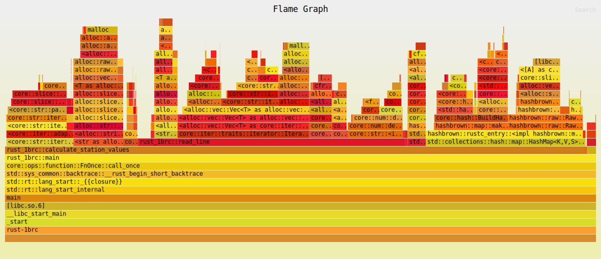

Heyo folks!

This blog talks about my journey of tackling the [1 Billion Row
Challenge](https://github.com/gunnarmorling/1brc) (1BRC) and the insights I
gained along the way.

It all began when [Shraddha](https://x.com/shraddhaag) introduced me to this
challenge through her implementation in Go. (Seriously, if you haven't read her
[article](https://www.bytesizego.com/blog/one-billion-row-challenge-go) yet, go
check it out!) Her work sparked my curiosity: How would this challenge play out
in Rust? More importantly, how would the mental model shift when switching
languages?

I started out with a humble 5 minute execution time and was able to bring it
down to 9 seconds \o/. That's right - we're talking about a speedup of over 33x!
But the numbers only tell part of the story. The real adventure was in the
learning, the optimizations, and the "aha!" moments along the way

## What is the 1 Billion Row Challenge?

**Input**: A 14 GB text file containing 1 billion rows of temperature
measurements from various weather stations. Each line has the format 
`<string: station name>;<double: measurement>`

**Output**: An alphabetically sorted list of cities with their temperature statistics, formatted as: 
`{city1=<min>/<mean>/<max>, city2=<min>/<mean>/<max>, ...}`

#### Why is this challenging?
The sheer volume of data - one billion rows - makes this task non-trivial.
Processing such a large dataset quickly requires careful consideration of
various constraints. Plus, let's face it - there's something alluring about
conquering a "billion" of anything!

#### My additional rules
While adhering to the [official rules](https://github.com/gunnarmorling/1brc), I set some personal challenges:

1. Achieve single-digit runtime (why? because I love challenges :P)
2. No unsafe code (safety first!)
3. Simple, maintainable code (testing the "dumb code is the best code" theory)

### Tools and Links

Links:
* My code: https://github.com/Naveenaidu/rust-1brc

Tools:
* System: Apple M1 Pro (2021 model, 16GB memory, 10 vCPU)
* Language: Rust 1.77.0

### Breaking Down the Challenge: A Preliminary Assessment

Before diving into the challenge, it's crucial to break down the problem into
manageable sub-tasks. At a high level, we're facing three main challenges:

1. Reading a 14 GB file efficiently
   * Read the entire file at once?
   * Read the file in a streaming manner (in chunks)
2. Choosing the right data structure to store and process the information
   * The task requires us to quickly look up temperature data for a given
     station name, avoid duplicating station names and efficiently update min,
     max and mean. HashMap is the right fit for these conditions
3. Processing the data effectively
    * This is where the real challenge lies, As we progress through the
      implementations - we’ll explore various optimizations techniques to
      address this challenge

## Initial solution: 253s

Commit Link:
[Commit](https://github.com/Naveenaidu/rust-1brc/commit/455609a22e844759779a0a2c152047a8dfe0c981)

The first attempt at this challenge was done in the naivest way possible. Here's how it worked:
1. Read the entire file into a `String`
2. Iterate through the new lines:
    * Parse the line to get the station name and value
    * Make this entry to the hashmap
        * If an entry already exists, update the values. 
3. Transfer data to a `BTreeMap` for sorted output.

```rust
fn read_line(data: String) -> (String, f32) {
    let parts: Vec<&str> = data.split(';').collect();
    let station_name = parts[0].to_string();
    let value = parts[1].parse::<f32>().expect("Failed to parse value");
    (station_name, value)
}

// Calculate the station values
fn calculate_station_values(data: String) -> HashMap<String, StationValues> {
    let mut result: HashMap<String, StationValues> = HashMap::new();
    for line in data.lines() {
        let line = line.trim();
        let (station_name, value) = read_line(line.to_string());
        result
            .entry(station_name)
            .and_modify(|e| {
                if value < e.min {
                    e.min = value;
                }
                if value > e.max {
                    e.max = value;
                }
                e.mean = e.mean + value;
                e.count += 1;
            })
            .or_insert(StationValues {
                min: value,
                max: value,
                mean: value,
                count: 1,
            });
    }

    result
}
```

### Flamegraph Analysis




The flamegraph reveals that:
* 45% of execution time is in the `read_line` function.
* Within read_line:
    * 22% in `collect()`
    * 10% in `parse()`
    * 4% in `to_string()`


The flamegraph shows that the `collect()` calls invoke malloc system calls. This
means, for each of our billions lines, we're allocating memory on heap,
processing it and immediately discarding this memory. This unnecessary
allocation and deallocation seems like a performance bottleneck.

The reason I used a vector is to easily access the station names and its values
by index. However, we can achieve the same result more efficiently: 
* Instead of `collect()`ing into a vector, we can use the iterator returned by
`split()` directly. 
* Use `next()` to access elements, avoiding allocation altogether. This
realisation sets the stage for our next optimization attempt.

#### Bloopers
I had a couple of “face palm” moments when trying to calculate the execution time for this solution:

1. Forgot the `--release` flag:
    * I ran the solution without the --release flag, resulting in a staggering
      30-minute execution time. This totally threw me off!
    * Adding the --release flag reduced the time to about 20 minutes. This still
      seemed on a bit higher side P_P
    * Always use the --release flag for performance testing. Debug builds in Rust
      include many checks and lack optimizations, making them significantly slower.
2. `println!` in the hot path:
    * I had a `println!` statement inside the read_line function, which
      processes the billion lines.
    * Apparently, each `println!` makes a [system
      call](https://www.reddit.com/r/rust/comments/vvog9m/need_explanation_of_print_behavior/).
      When placed in a loop iterating a billion times, this results in a billion
      system calls, dramatically slowing down execution. Always be cautious
      about I/O operations in hot paths. 
    * Removing the println! from the hot path the execution time is 253 seconds.